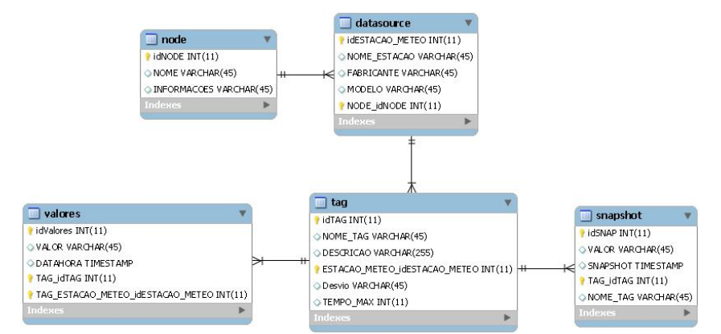
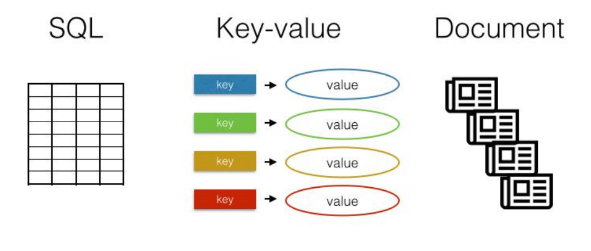
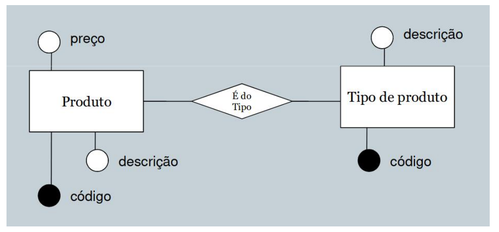
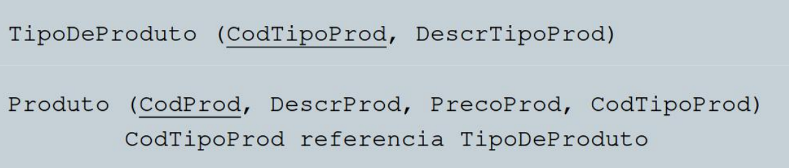
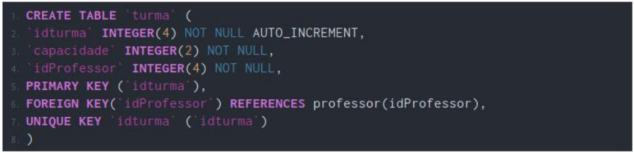
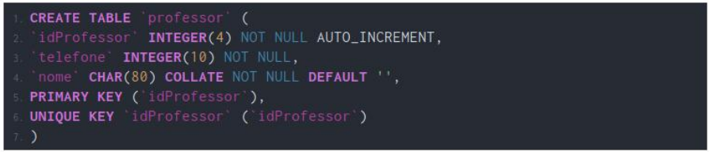

# Introdução

Dado -> Elemento bruto geralmente proveniente de uma entrada do usuário ou de outros sistemas.
Informação -> Elemento processado (lapidado) constituído de dados.

O que são Banco de dados?
São coleções organizadas de dados que se relacionam ou não, de forma a armazenar informações.

SGBDRs - Sistemas Gerenciadores de Bancos de Dados

# Banco de dados podem ser: 

  <h2> Relacional = </h2>
  
  Um banco de dados relacional é um tipo de sistema de gerenciamento de banco de dados (SGBDR) que organiza e armazena dados em tabelas com estruturas relacionais.

  

  <h3> Exemplos: </h3>

  

  <h2> Não Relacional = </h2>
  
  Um banco de dados não relacional, muitas vezes chamado de banco de dados NoSQL (que significa "Not Only SQL" ou "Não Apenas SQL"), é um tipo de sistema de gerenciamento de banco de dados projetado para armazenar e gerenciar dados de maneira que não segue o modelo de banco de dados relacional tradicional. 
  
  Esses sistemas de banco de dados são usados quando os requisitos de uma aplicação não se encaixam bem com as estruturas de dados tabulares e relacionais. Alta disponibilidade e maior escalabilidade SQL, 
  
  Key-Value e Document estruturas de banco de dados nao relacionais 

  

  <h3> Exemplos: </h3>

  
  

# Modelagem de dados:

Modelagem conceitual:

É o modelo de mais alto nível 

Pode ser elaborado de forma textual ou por meio de dois diagramas: Diagramade Entidade e Relacionamento e/ou Diagrama de Classes*. 

Tipos: Textual, Diagrama de Entidade e Relacionamento e Diagrama de Classes

Modelagem Lógica:

Descreve como os dados serão armazenados no banco de dados e também seus relacionamentos

Modelagem Física:

É a forma de modelagem da própria implementação no banco de dados

# Formas normais 

### Primeira Forma Normal - 1NF

Ela estabelece que todas as colunas em uma tabela devem conter valores atômicos e indivisíveis, e cada coluna deve ter um nome exclusivo. Além disso, a ordem em que os dados são armazenados não deve ter importância.

| ID | Nome                    | Disciplinas          |
|----|-------------------------|----------------------|
| 1  | João                    | Matemática, Física   |
ERRADO

| ID | Nome                    | Disciplinas         | Disciplinas       |
|----|-------------------------|---------------------|-------------------|
| 1  | João                    | Matemática          | Física            |
CERTO

    Cada célula da tabela deve conter um único valor, e esse valor deve ser indivisível. Isso significa que você não deve ter valores compostos ou estruturados em uma única célula.

---
### Segunda Forma Normal - 2NF

Estabelece que todos os atributos não-chave (ou seja, aqueles que não fazem parte de uma chave primária composta) devem ser totalmente dependentes da chave primária.

| ID | Curso       | Professor   | Departamento |
|----|-------------|-------------|--------------|
| 1  | Matemática  | Dr. Silva   | Exatas       |
| 2  | Física      | Dr. Souza   | Ciencias     |
| 3  | Matemática  | Dr. Almeida | Exatas       |

    A chave primária é composta por duas colunas: ID e Curso. A 2NF requer que cada atributo não-chave seja totalmente dependente da chave primária. No entanto, a coluna Departamento depende apenas parcialmente da chave primária, pois o valor do departamento pode ser determinado apenas pelo curso, e não pelo ID.

##### Tabela Cursos
| ID | Curso      |
|----|------------|
| 1  | Matemática |
| 2  | Física     |

##### Tabela Departamento
|ID | id_curso   | Departamento |
|---|------------|--------------|
|1  | 1          | Exatas       |
|2  | 2          | Ciencias     |

##### Tabela Professor

| ID | id_departam| Professor    |
|----|------------|--------------|
| 1  | 1          | Dr. Silva    |
| 2  | 2          | Dr. Souza    |
| 3  | 1          | Dr. Almeida  |

