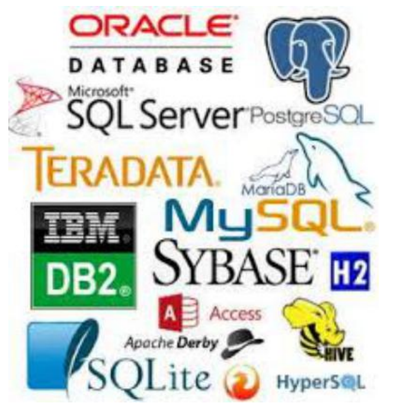

# Introdução

Dado -> Elemento bruto geralmente proveniente de uma entrada do usuário ou de outros sistemas.
Informação -> Elemento processado (lapidado) constituído de dados.

O que são Banco de dados?
São coleções organizadas de dados que se relacionam ou não, de forma a armazenar informações.

SGBDRs - Sistemas Gerenciadores de Bancos de Dados

# Banco de dados podem ser: 

  <h2> Relacional = </h2>
  
  Um banco de dados relacional é um tipo de sistema de gerenciamento de banco de dados (SGBDR) que organiza e armazena dados em tabelas com estruturas relacionais.

  

  <h3> Exemplos: </h3>

  

  <h2> Não Relacional = </h2>
  
  Um banco de dados não relacional, muitas vezes chamado de banco de dados NoSQL (que significa "Not Only SQL" ou "Não Apenas SQL"), é um tipo de sistema de gerenciamento de banco de dados projetado para armazenar e gerenciar dados de maneira que não segue o modelo de banco de dados relacional tradicional. 
  
  Esses sistemas de banco de dados são usados quando os requisitos de uma aplicação não se encaixam bem com as estruturas de dados tabulares e relacionais. Alta disponibilidade e maior escalabilidade SQL, 
  
  Key-Value e Document estruturas de banco de dados nao relacionais 

  

  <h3> Exemplos: </h3>

  
  

# Modelagem de dados:

Modelagem conceitual:

É o modelo de mais alto nível 

Pode ser elaborado de forma textual ou por meio de dois diagramas: Diagramade Entidade e Relacionamento e/ou Diagrama de Classes*. 

Tipos: Textual, Diagrama de Entidade e Relacionamento e Diagrama de Classes

Modelagem Lógica:

Descreve como os dados serão armazenados no banco de dados e também seus relacionamentos

Modelagem Física:

É a forma de modelagem da própria implementação no banco de dados

